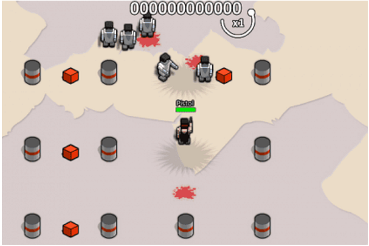
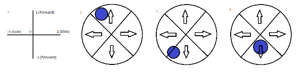
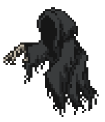
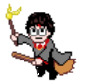
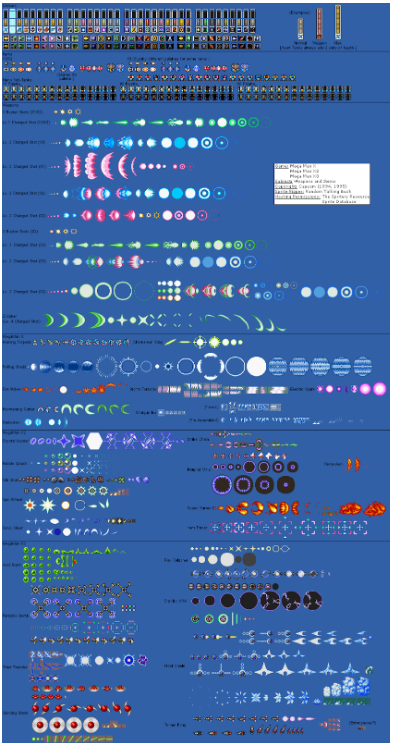

# Hogwarts Fury
## Inspiracja
Gra jest bazowana na grze BoxHead, czyli starej grze przeglądarkowej, przedstawiającej w rzucie izometrycznym bohatera, który walczy z kolejnymi falami zombie i innych typów przeciwników, zbiera broń i amunicję i zdobywa punkty.

## Koncept
W naszej grze, bohaterem jest czarodziej z uniwersum Harrego Pottera i będzie walczył z dementorami / inferiusami itd…

Ciężko było oszacować jak dużo rzeczy uda się zrobić w projekcie, więc ustaliliśmy priorytety na różne elementy gry.
### Priorytety:
- [X] dodanie bohatera, przeciwników, prostokątnej mapy, możliwości zadawania obrażeń
- [X] algorytm podążania za graczem
- [X] urozmaicenie mapy
- [ ] dopracowanie warstwy wizualnej
- [ ] dodanie większej ilości elementów rozgrywki (czary, przeciwnicy) 

## Mechanika
### Poruszanie

Opracowaliśmy dwa sposoby poruszania się postacią, z których jeden będzie wybierany w zależności od tego, który będzie lepiej działał
#### Opcja 1.
Postacią będziemy poruszać przy pomocy joysticka pod lewym kciukiem, obracać się zaś będziemy przy pomocy joysticka pod prawym. Prawym kciukiem będziemy również rzucać zaklęcia
#### Opcja 2.
Postacią będziemy poruszać przy pomocy joysticka pod lewym kciukiem, prawym kciukiem będziemy rzucać zaklęcia w kierunku poruszania

### Przeciwnicy
Przeciwnicy nadchodzą falami, a ich poziom trudności będzie wzrastał. Będzie jeden typ przeciwników - dementorzy. Jeśli będzie czas, stworzymy ich więcej

Każdy przeciwnik będzie miał określoną ilość życia pokazaną poprzez pasek nad jego spritem i określone obrażenia, które może zadawać graczowi.

Póki co cały czas jest jedna fala, ale rozgrywka jest coraz trudniejsza, bo przeciwnicy tworzą się szybciej niż gracz jest w stanie ich zabić.

### Postać gracza

Gracz może poruszać i rzucać zaklęcia, zadając obrażenia przeciwnikom, sam otrzymuje obrażenia jeśli przeciwnik zbliży się do niego wystarczająco.

### Punkty
Za zabicie danego przeciwnika, gracz otrzymuje punkty doświadczenia, w ten sposób wchodząc na kolejne poziomy. Na planszy są losowo rozrzucone zaklęcia jako “znajdźki” w skrzyniach, a po ich zebraniu gracz będzie mógł z nich korzystać przez określony czas.

### Śmierć
Jeśli gracz zginie, zaczyna od zera z tylko jednym zaklęciem podstawowym.

## Mapa
Najpierw mapa była tylko tłem po którym poruszały się postacie i była nieograniczona. Teraz mapa to prostokąt przypominający dziedziniec zamkowy ograniczony przez mury, za którymi nie można wyjść. Na mapie są rozrzucone skrzynie z zaklęciami, które gracz może podnieść i używać przez określony czas. Dementorzy nadchodzą z czterech korytarzy na granicach mapy.

## Kamera
Kamera będzie podążać za graczem tak, żeby cały czas był
na środku

## Atak
Znaleźlismy wiele możliwości stworzenia alaków dla gracza i wybraliśmy dla tego projektu trzy, z których korzystamy.\

## Assety
Warstwę wizualną stworzyliśmy z wykorzystaniem dostępnych w internecie assetów. Część z nich pochodzi z Unity Store, a część z różnych serwisów z obrazkami. W niektórych przypadkach pobrane assety zostały przez nas dodatkowo zmodyfikowane.

Źródła:

https://www.clipartmax.com/middle/m2i8K9G6b1b1K9G6_harry-potter-harry-potter-pixel-art/

https://www.artstation.com/artwork/3dRLkm

https://www.pixilart.com/art/fire-bullet-a83dee9d75c547b

https://www.shutterstock.com/image-vector/pixel-art-wood-style-button-game-2170120749
